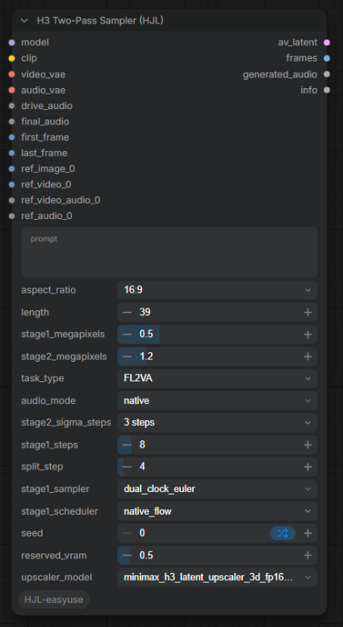
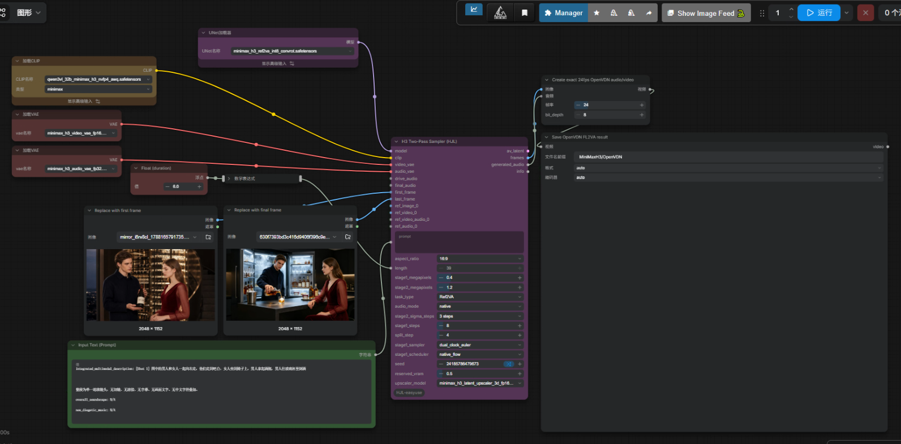

# ComfyUI-HJL-easyuse

[English](README_EN.md) | 简体中文

面向 **MiniMax H3 音视频生成**的 ComfyUI 自定义节点集。把多节点的双阶段采样工作流打包成一键节点。

## 节点列表

### H3 Two-Pass Sampler (HJL)

一键复刻 MiniMax H3 双阶段采样工作流（低分辨率 DMD 双时钟采样 → 3D latent 放大 + 原图 VAE 重编码条件 → 高分辨率蒸馏 sigmas 收尾 → 内置 AV 解码）。



**输入：**

| 端口 | 说明 |
|---|---|
| model / clip / video_vae / audio_vae | H3 底模、Qwen3-VL CLIP、video VAE(fp16)、audio VAE(fp32) |
| prompt / aspect_ratio / length | 提示词、画幅比（16:9 等 6 种）、帧数（自动对齐 17n+5） |
| stage1_megapixels | 第一阶段目标像素（默认 0.4MP，16:9 → 864x480） |
| stage2_megapixels | 第二阶段目标像素（默认 1.2MP，16:9 → 1504x832） |
| task_type / audio_mode | T8 任务类型与音频模式 |
| stage2_sigma_steps | 第二阶段蒸馏 sigmas 预设（3/4/5 steps） |
| stage1_steps / split_step / stage1_sampler / stage1_scheduler | 第一阶段双时钟采样参数 |
| seed | 随机种子 |
| drive_audio / final_audio / first_frame / last_frame | 可选：驱动音频、混音音轨、首尾帧 |
| ref_images (autogrow, 最多 8) | 参考图，第二阶段用原图重新 VAE 编码（画质最优） |
| ref_videos (autogrow, 最多 3) | 参考视频（24fps 帧序列） |
| ref_video_audios (autogrow, 最多 3) | 为对应序号的 ref_video 配音轨 |
| ref_audios (autogrow, 最多 3) | 独立参考音频 |
| reserved_vram / upscaler_model | 显存预留与放大模型选择 |

**输出：**

| 端口 | 说明 |
|---|---|
| av_latent | 音视频合一 latent（仍可外接 MiniMaxH3AVDecodeT8 做后处理） |
| frames | 解码后的图像帧序列（IMAGE） |
| generated_audio | 解码后的音频（AUDIO） |
| info | 执行摘要（分辨率 / 帧数 / 引用数量 / sigmas 预设） |

> **显存时序说明**：节点内部的两个 ReservedVRAM 设置都在开头执行一次（与原工作流真实执行顺序一致），运行期间不卸载模型，阶段2 直接复用阶段1 已加载的 UNET。请勿在外部再对同一 prompt 挂载运行中卸载模型的节点。

### H3 Edit Conditioning W/H (HJL)

H3 两阶段放大专用：更新 conditioning 宽高，并把 `minimax_refs` / `minimax_keyframes` 里的参考 latent 调整到新尺寸。

- 接 `vae` + 原始 ref_image / first_frame / last_frame 时，按新分辨率**从原图重新 VAE 编码**（画质最优，与官方高分辨率重新 Conditioning 同质量）；
- 未接原图的部分走 latent 插值（trilinear / nearest / area）；
- 自动同步 ref 的 latent_h / latent_w / latent_t，彻底解决两阶段放大的 `shape mismatch` 报错。

画质排序：**原图重编码（接图） > latent decode→encode > latent 插值**。

## 依赖节点（必装）

本节点在运行时调用以下节点包，请一并安装：

| 依赖 | 用途 | 许可证 | 链接 |
|---|---|---|---|
| comfyui-minimax-h3-audio-T8 | H3 Conditioning / DualClockSampler / AVDecode 等核心节点 | GPL-3.0-or-later | <https://github.com/T8mars/comfyui-minimax-h3-audio-T8> |
| ComfyUI-ReservedVRAM | 显存预留与清理（ReservedVRAMSetter） | Apache-2.0 | <https://github.com/Windecay/ComfyUI-ReservedVRAM> |
| Comfyui_Minimax_h3_latent_Upscaler | H3 3D latent 放大模型（MinimaxH3LatentUpscaler3D） | 未标注 | <https://github.com/LBH-123-AI/Comfyui_Minimax_h3_latent_Upscaler> |
| ComfyUI 内置节点 | RandomNoise / SplitSigmas / BasicGuider / KSamplerSelect / ManualSigmas / SamplerCustomAdvanced / LTXVSeparateAVLatent / LTXVConcatAVLatent | GPL-3.0（ComfyUI 主程序） | ComfyUI 自带 |

> 感谢以上上游项目的作者。本仓库未复制/修改任何上游源码，仅在运行时通过 ComfyUI 节点注册表调用其节点。

## 加速技术（可选）

以下两项**不是本节点的必装依赖**——H3 Two-Pass Sampler 默认走原始 model 直连路径。它们出现在 `workflows/` 的 OpenVDN 加速示例工作流中，按需安装：

### VDN-H3（OpenVDN VideoDeltaNet 混合注意力加速）

<https://github.com/OpenVDN/vdn-minimax-h3>

在 MiniMax H3 上外挂一条帧级线性注意力分支 + 两个小型 LoRA 适配器，实现近无损的推理加速（8 步去噪即可出片）。示例工作流 `Minimax_H3_OpenVDN_DMD8_FL2VA_two_pass_workflow_HJL.json` 通过 T8 包的 `MiniMaxH3VDNModelComposerT8Advanced` 节点加载 HuggingFace 上的 `OpenVDN/vdn-minimax-h3` 权重（`stage_dmd_8nfe` 分支）。

- 代码：Apache-2.0
- **模型权重：单独发布在 HuggingFace，遵循 MiniMax H3 Community License**（不在 Apache 覆盖范围内）

### Sol-Attn（稀疏注意力加速）

Sol-Attn 是 NVIDIA 提出的免训练稀疏注意力方法（[arXiv 2607.24027](https://arxiv.org/abs/2607.24027)），对长序列注意力做块级稀疏化，显著加速视频生成。

示例工作流中的 `SolAttnMiniMax` 节点来自 [kijai/ComfyUI-SolAttn_triton](https://github.com/kijai/ComfyUI-SolAttn_triton)（单文件版 `sol_attn_minimax_v2.py`）。注意：

- 该仓库现已标记 **DEPRECATED**——新版 ComfyUI / comfy-kitchen 已内置优化后的 Sparse Attention（含 sol-attn），优先通过 `comfy-kitchen` 的 `sol_attn` CUDA kernel 使用（需 sm_80+ / bf16 / head_dim 128）；
- 依赖 `comfy_kitchen`（安装时需带 `sol_attn` 支持）；
- `tau`（稀疏温度）、`start/end_percent` 用于平衡质量与速度；首次运行需编译 kernel，会偏慢。

## 安装

```bash
cd ComfyUI/custom_nodes
git clone https://github.com/hjl668877/ComfyUI-HJL-easyuse.git
```

然后安装依赖节点包并重启 ComfyUI。

所需模型文件（H3 底模 / VAE / CLIP / latent 放大模型）请按 comfyui-minimax-h3-audio-T8 与 upscaler 仓库的说明下载放置。

## Example Workflows

`workflows/` 目录提供两个示例：

| 文件 | 说明 | 额外依赖 |
|---|---|---|
| `Minimax_H3_two_pass_sampler_example_workflow_HJL.json` | 基础双阶段工作流（H3_TwoPassSampler 一键节点版） | 仅必装依赖 |
| `Minimax_H3_OpenVDN_DMD8_FL2VA_two_pass_workflow_HJL.json` | OpenVDN DMD8 + FL2VA（首尾帧）加速版，含 VDN 模型合成与 Sol-Attn 稀疏注意力 | 需另装 VDN-H3 权重与 Sol-Attn 节点，见上方「加速技术」 |

加载后按 T8 仓库说明放置模型文件即可运行。

基础版工作流整体效果：



## License

本节点强依赖 GPL-3.0 的 comfyui-minimax-h3-audio-T8（运行时动态调用），为保持许可证一致，本仓库以 **GPL-3.0-or-later** 发布（见 [LICENSE](LICENSE)）。所依赖的上游节点包归各自作者所有，使用时请遵循其原始许可证（VDN-H3 模型权重遵循 MiniMax H3 Community License）。

## 更新计划

- [x] 示例工作流 JSON（基础版 + OpenVDN 加速版）
- [ ] 更多画幅比与时长组合示例