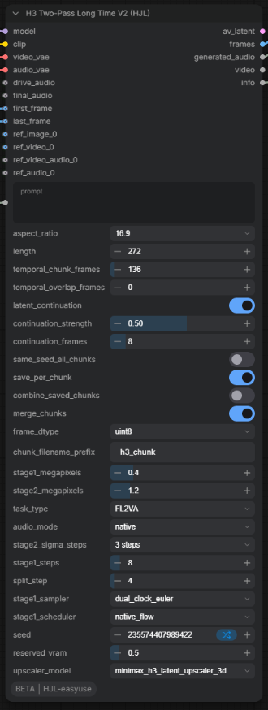

# ComfyUI-HJL-easyuse

English | [简体中文](README.md)

A collection of ComfyUI custom nodes for **MiniMax H3 audio-video generation**. Packs the multi-node two-pass sampling workflow into one-click nodes.

## Nodes

### H3 Two-Pass Sampler (HJL)

One-click recreation of the MiniMax H3 two-pass sampling workflow (low-res DMD dual-clock sampling → 3D latent upscale + original-image VAE re-encoded conditioning → high-res distillation-sigmas refinement → built-in AV decoding).


**Inputs:**

| Port | Description |
|---|---|
| model / clip / video_vae / audio_vae | H3 base model, Qwen3-VL CLIP, video VAE (fp16), audio VAE (fp32) |
| prompt / aspect_ratio / length | Prompt, aspect ratio (6 options incl. 16:9), frame count (auto-aligned to 17n+5) |
| stage1_megapixels | Stage-1 target pixels (default 0.4MP; 16:9 → 864x480) |
| stage2_megapixels | Stage-2 target pixels (default 1.2MP; 16:9 → 1504x832) |
| task_type / audio_mode | T8 task type and audio mode |
| stage2_sigma_steps | Stage-2 distillation sigma preset (3/4/5 steps) |
| stage1_steps / split_step / stage1_sampler / stage1_scheduler | Stage-1 dual-clock sampling parameters |
| seed | Random seed |
| drive_audio / final_audio / first_frame / last_frame | Optional: driving audio, mixdown track, first/last frame |
| ref_images (autogrow, up to 8) | Reference images; stage 2 re-encodes them from the originals via VAE (best quality) |
| ref_videos (autogrow, up to 3) | Reference videos (24fps frame batches) |
| ref_video_audios (autogrow, up to 3) | Audio track for the reference video with the same index |
| ref_audios (autogrow, up to 3) | Standalone reference audio |
| reserved_vram / upscaler_model | VRAM reservation and upscaler model selection |

**Outputs:**

| Port | Description |
|---|---|
| av_latent | Combined audio-video latent (can still be fed to MiniMaxH3AVDecodeT8 for post-processing) |
| frames | Decoded image frame sequence (IMAGE) |
| generated_audio | Decoded audio (AUDIO) |
| info | Execution summary (resolution / frame count / reference counts / sigma preset) |

> **VRAM timing note**: both internal ReservedVRAM settings execute once at the very beginning (matching the real execution order of the original workflow). No models are unloaded mid-run — stage 2 reuses the UNET already loaded by stage 1. Do not attach external nodes that unload models mid-run to the same prompt.

### H3 Two-Pass Long Time V2 (HJL)

The **long-video** node: splits a clip into equal time chunks, runs a full two-pass sampling per chunk, and stitches them together with **latent continuation**. Supports **per-chunk prompts** so different segments can be described differently.



With a single chunk the behavior matches H3 Two-Pass Sampler; once the total length exceeds the per-chunk cap (`temporal_chunk_frames`) it splits automatically, breaking past the single-run length limit.

**Core mechanisms**

| Mechanism | Description |
|---|---|
| Time chunking | chunks = ⌈length ÷ temporal_chunk_frames⌉, then the total frame count is **split evenly** across chunks to avoid a very short tail chunk (the old fixed-cut method produced 136+136+16, making the last chunk impossible to connect) |
| Latent continuation | takes the **stage-1 denoised video latent tail** of the previous chunk (8 frames by default) and, after truncating the sigma schedule by `continuation_strength`, uses it as the next chunk's starting point — inheriting motion, detail and texture instead of re-imagining from pure noise |
| Per-chunk prompts | separate with a **line containing only** `---` inside `prompt`; they map to chunk 1/2/3… in order. If fewer prompts than chunks, the remaining chunks reuse the last one; without `---` the prompt applies to all chunks |

**Key inputs** (all other ports are identical to H3 Two-Pass Sampler)

| Port | Default | Description |
|---|---|---|
| prompt | empty | Video description; supports `---` chunking |
| length | 141 | **Total** frame count (24fps) |
| temporal_chunk_frames | 136 | Per-chunk frame **cap**, must be a multiple of 17 (set it to what you can reliably run in one go; 6s ≈ 136) |
| temporal_overlap_frames | 0 | **Extra** frames dropped at the start of each chunk. The node always drops the 1 duplicated anchor frame; N here drops N more (large values cause time jumps) |
| latent_continuation | True | Toggle latent continuation (off = each chunk restarts from pure noise) |
| continuation_strength | 0.5 | 0–1: higher stays closer to the previous chunk (smoother, less change); use ~0.3 together with per-chunk prompts |
| continuation_frames | 8 | How many latent time frames of the previous chunk seed the next one |
| same_seed_all_chunks | False | Share one seed across chunks for more consistent texture |
| save_per_chunk | True | Write PNGs to `output/h3_chunks/<prefix>/chunk_XXXX/` right after each chunk and release its frames |
| combine_saved_chunks | False | After the run, stream-combine all chunk PNGs into `combined.mp4` via ffmpeg (zero memory spike at the end) |
| merge_chunks | True | Concatenate all chunks into the `frames` output; **turn it off beyond ~15s** and use the disk path instead |
| frame_dtype | uint8 | Accumulation precision: uint8 saves 4× memory (output is still fp32 `[0,1]`; no audible/visible quality impact) |
| chunk_filename_prefix | h3_chunk | Output subfolder name |

**Outputs**

| Port | Description |
|---|---|
| av_latent | AV latent of the last chunk |
| frames | Full frame sequence (`merge_chunks=True`); otherwise last chunk only |
| generated_audio | Audio concatenated across chunks |
| **video** | VIDEO when combining succeeded — connect it to any video preview/save node; an inline preview also appears on the node |
| info | Execution summary (chunks / frames per chunk / continuation state / prompt chunks / output path) |

**Duration ↔ frames ↔ chunks** (24fps, `temporal_chunk_frames = 136`)

| Duration | length | Chunks | Frames per chunk |
|---|---|---|---|
| 5.67s | 136 | 1 | 136 |
| 8s | 192 | 2 | 96 + 96 |
| **11.33s** | **272** | **2** | **136 + 136** ⭐ |
| 12s | 288 | 3 | 96 × 3 |
| **17s** | **408** | **3** | **136 × 3** ⭐ |
| 20s | 480 | 4 | 120 × 4 |
| **22.67s** | **544** | **4** | **136 × 4** ⭐ |
| 30s | 720 | 6 | 120 × 6 |
| **34s** | **816** | **6** | **136 × 6** ⭐ |
| 45.33s | 1088 | 8 | 136 × 8 ⭐ |

Rule: `chunks = ⌈length ÷ 136⌉`; when `length = N × 136` every chunk is exactly equal (5.67 / 11.33 / 17.00 / 22.67 / 28.33 / 34.00 / 39.67 / 45.33 / 51.00 / 56.67 s), giving the most predictable VRAM and runtime. To fix the chunk count, adjust `temporal_chunk_frames`: `chunk ≥ length ÷ desired chunks`, rounded up to a multiple of 17.

**Three ways to get the result**

| Case | Configuration |
|---|---|
| ≤15s | `merge_chunks=True`, use the `frames` / `video` ports |
| Longer (recommended) | `merge_chunks=False` + `save_per_chunk=True` + `combine_saved_chunks=True` — everything goes to disk, zero memory spike |
| Rescue already-saved PNGs | Standalone tool `combine_h3_chunks.py` (see below) |

> ⚠️ The bottleneck for long videos is usually **system RAM**, not VRAM: ComfyUI keeps frames as fp32 (≈15MB per frame at 1.2MP) and stages model weights on demand. Close memory-hungry apps before running; with `merge_chunks=True` the ending needs a full fp32 frame sequence in memory (≈4GB for 11s, ≈21GB for 60s).

### H3 Edit Conditioning W/H (HJL)

Built for H3 two-pass upscaling: updates conditioning width/height and resizes the reference latents inside `minimax_refs` / `minimax_keyframes` to the new resolution.

- With `vae` + original ref_image / first_frame / last_frame connected, **re-encodes from the original images** at the new resolution (best quality, on par with official high-res re-conditioning);
- References without an original image fall back to latent interpolation (trilinear / nearest / area);
- Automatically syncs each reference's latent_h / latent_w / latent_t, completely eliminating the `shape mismatch` error in two-pass upscaling.

Quality ranking: **original-image re-encoding (images connected) > latent decode→encode > latent interpolation**.

## Third-party compatibility patch: `t8_compat.py`

comfyui-minimax-h3-audio-T8's **Hybrid** compatibility probe builds a keyframe with an illegal index on current ComfyUI builds (neither the first frame 0 nor the last frame `frame_count-1`), so the probe always raises and the Hybrid path gets disabled — surfacing as this error when first/last frame **and** reference images are connected together:

```
RuntimeError: The active MiniMax H3 PackedLayout implementation rejected
the guarded legacy Hybrid compatibility probe.
```

This pack **does not modify T8's source**: it applies an in-memory runtime patch (`t8_compat.py` → `ensure_t8_hybrid_probe_fix()`) that rewrites the illegal index to the first frame before delegating to the original function. T8's real generation path only ever uses legal indices, so generation results are unaffected; **once upstream fixes it, the patch degrades into a transparent pass-through** and needs no manual removal. Every sampler node in this pack (H3 Two-Pass Sampler / H3 Two-Pass Long Time V2) calls it at the top of `execute` (idempotent).

## Standalone tool: `combine_h3_chunks.py`

Combine already-saved per-chunk PNG sequences into an MP4 **without re-running the node**:

```bash
python combine_h3_chunks.py "D:/ComfyUI_windows_portable_nvidia/ComfyUI/output/h3_chunks/h3_chunk" \
    --fps 24 --crf 18
```

It concatenates all PNGs under `chunk_*/` in directory order and writes `combined.mp4` (H.264 / yuv420p). Requires `imageio-ffmpeg` (bundles an ffmpeg binary; `pip install imageio-ffmpeg`).

## Required Dependencies

These node packages are called at runtime and must be installed alongside:

| Dependency | Purpose | License | Link |
|---|---|---|---|
| comfyui-minimax-h3-audio-T8 | Core nodes: H3 Conditioning / DualClockSampler / AVDecode etc. | GPL-3.0-or-later | <https://github.com/T8mars/comfyui-minimax-h3-audio-T8> |
| ComfyUI-ReservedVRAM | VRAM reservation & cleanup (ReservedVRAMSetter) | Apache-2.0 | <https://github.com/Windecay/ComfyUI-ReservedVRAM> |
| Comfyui_Minimax_h3_latent_Upscaler | H3 3D latent upscaler model (MinimaxH3LatentUpscaler3D) | Unlicensed | <https://github.com/LBH-123-AI/Comfyui_Minimax_h3_latent_Upscaler> |
| ComfyUI built-in nodes | RandomNoise / SplitSigmas / BasicGuider / KSamplerSelect / ManualSigmas / SamplerCustomAdvanced / LTXVSeparateAVLatent / LTXVConcatAVLatent | GPL-3.0 (ComfyUI core) | Bundled with ComfyUI |

> Thanks to the authors of the upstream projects. This repository neither copies nor modifies any upstream source code — it only calls their nodes through the ComfyUI node registry at runtime.

## Acceleration Technologies (Optional)

The following two are **not hard dependencies** — H3 Two-Pass Sampler uses the plain model path by default. They appear in the OpenVDN accelerated example workflow under `workflows/`; install as needed:

### VDN-H3 (OpenVDN VideoDeltaNet hybrid-attention acceleration)

<https://github.com/OpenVDN/vdn-minimax-h3>

Attaches a frame-wise linear-attention branch plus two small LoRA adapters to MiniMax H3 for near-lossless inference speedup (generates in as few as 8 denoising steps). The example workflow `Minimax_H3_OpenVDN_DMD8_FL2VA_two_pass_workflow_HJL.json` loads the `OpenVDN/vdn-minimax-h3` weights from HuggingFace (the `stage_dmd_8nfe` branch) via T8's `MiniMaxH3VDNModelComposerT8Advanced` node.

- Code: Apache-2.0
- **Model weights: released separately on HuggingFace under the MiniMax H3 Community License** (not covered by the Apache license)

### Sol-Attn (sparse attention acceleration)

Sol-Attn is a training-free sparse attention method from NVIDIA ([arXiv 2607.24027](https://arxiv.org/abs/2607.24027)) that sparsifies long-sequence attention at the block level, substantially speeding up video generation.

The `SolAttnMiniMax` node in the example workflow comes from [kijai/ComfyUI-SolAttn_triton](https://github.com/kijai/ComfyUI-SolAttn_triton) (the single-file variant, `sol_attn_minimax_v2.py`). Notes:

- That repository is now marked **DEPRECATED** — recent ComfyUI / comfy-kitchen builds ship an optimized built-in Sparse Attention (including sol-attn); prefer the `sol_attn` CUDA kernels from `comfy-kitchen` (requires sm_80+ / bf16 / head_dim 128);
- Requires `comfy_kitchen` (installed with `sol_attn` support);
- `tau` (sparsity temperature) and `start/end_percent` trade quality against speed; the first run compiles kernels and will be slower.

## Installation

```bash
cd ComfyUI/custom_nodes
git clone https://github.com/hjl668877/ComfyUI-HJL-easyuse.git
```

Then install the dependency node packs and restart ComfyUI.

Model files (H3 base model / VAE / CLIP / latent upscaler) should be downloaded and placed according to the instructions in the comfyui-minimax-h3-audio-T8 and upscaler repositories.

## Example Workflows

Three examples are provided in `workflows/`:

| File | Description | Extra requirements |
|---|---|---|
| `Minimax_H3_two_pass_sampler_example_workflow_HJL.json` | Basic two-pass workflow (one-click H3_TwoPassSampler version) | Required dependencies only |
| `Minimax_H3_Two_Pass_FL2VA_Long_Time_V2_HJL_example.json` | **Long-video example**: H3 Two-Pass Long Time V2 + FL2VA first/last frame, 272 frames (11.33s / 2 chunks), with a `---` segmented prompt and a duration-vs-chunks note built in | Required dependencies only |
| `Minimax_H3_OpenVDN_DMD8_FL2VA_two_pass_workflow_HJL.json` | OpenVDN DMD8 + FL2VA (first-last frame) accelerated variant with VDN model composition and Sol-Attn sparse attention | Also needs VDN-H3 weights and the Sol-Attn node — see "Acceleration Technologies" above |

Place the model files as described in the T8 repository, then run. Overall layout of the basic workflow:


## License

This node pack strongly depends on comfyui-minimax-h3-audio-T8 (GPL-3.0, called dynamically at runtime). To keep the licenses consistent, this repository is released under **GPL-3.0-or-later** (see [LICENSE](LICENSE)). The upstream node packages remain the property of their respective authors — please follow their original licenses (the VDN-H3 model weights are subject to the MiniMax H3 Community License).

## Roadmap

- [x] Example workflow JSONs (basic + OpenVDN accelerated)
- [x] Long-video node H3 Two-Pass Long Time V2 (time chunking + latent continuation + per-chunk prompts)
- [x] Long-video example workflow (272 frames / 2 chunks / FL2VA)
- [ ] More aspect-ratio and duration combinations
